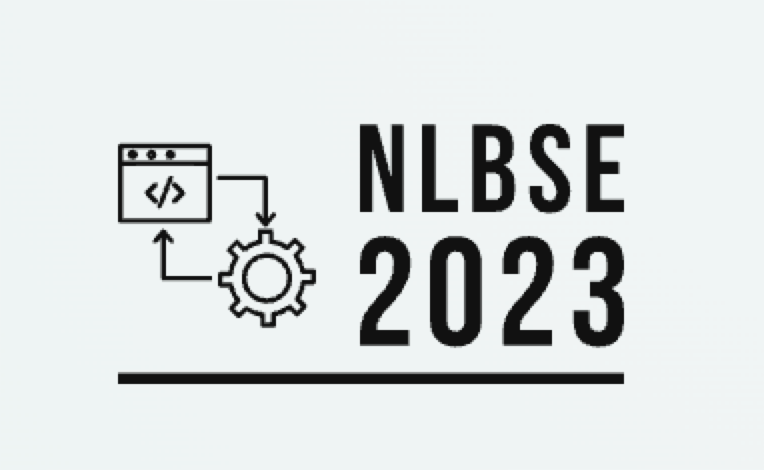

# NLBSE'23 Tool Competition on Issue Report Classification

## Introduction

This NLBSE tool competition is on automatic issue report classification, an important task in issue management and prioritization.

For the competition, we provide a dataset encompassing more than 1.4M labeled issue reports (as bugs, features, questions and documentation) extracted from real open-source projects. You are invited to leverage this dataset for evaluating your classification approaches and compare the achieved results against a two proposed baseline approaches based on FastText and RoBERTa.

## Participation

If you want to participate, you must:

- Train and tune a multiclass classifier using the provided [training set](https://tickettagger.blob.core.windows.net/datasets/nlbse23-issue-classification-train.csv.tar.gz). The classifier should assign one label to an issue.
- Evaluate your classifier on the provided [test set](https://tickettagger.blob.core.windows.net/datasets/nlbse23-issue-classification-test.csv.tar.gz)
- Write a short paper (2-4 pages) describing:
  - The architecture and details of the classifier
  - The procedure used to pre-process the data
  - The procedure used to tune the classifier on the training set
  - The results of your classifier on the test set
  - Additional info: provide a link to your code/tool with proper documentation on how to run it
- Submit the paper by the deadline (see below) on our submission form.

> The submission form will be published soon.

All submissions must conform to the [ICSE’23 formatting and submission instructions](https://conf.researchr.org/track/icse-2023/icse-2023-technical-track).

Papers do not need to be double-blinded.

## Important Dates
  
- Paper/tool submission: February 21, 2023
- Acceptance and competition results notification: March 4, 2023
- Camera-ready paper submission: March 17, 2023

All dates are anywhere on earth (AoE).

## Updates 

Compared to the 2022 version of the competition, we have made the following changes:

- Dataset size increased from 800k to 1.4M issue reports
- Added a new label `documentation` to the dataset
- Added synonyms of labels to the dataset
- Multi-label issues are now excluded from the dataset
- Non-english issues are now excluded from the dataset
- Added RoBERTa baseline

## Submission acceptance and competition

Submissions will be evaluated and accepted based on **correctness** and **reproducibility**, defined by the following criteria:

- Clarity and detail of the paper content
- Availability of the code/tool, including the training/tuning/evaluation pipeline, released as open-source
- Correct training/tuning/evaluation of your code/tool on the provided data
- Report the metrics and results we outline below
- Clarity of the code documentation

The accepted submissions will be published at the workshop proceedings.

The submissions will be ranked based on the F1 score (micro-averaged) achieved by the proposed classifiers on the test set, as indicated in the papers.

The submission with the highest F1 score will be the winner of the competition.

## Referencing

Since you will be using our dataset (and possibly one of our notebooks) as well as the original work behind the dataset, please cite the following references in your paper:

```
@inproceedings{nlbse2023issues,
  author={Kallis, Rafael and Izadi, Maliheh and Di Sorbo, Andrea and Panichella, Sebastiano},
  title={NLBSE'23 Tool Competition on Issue Report Classification},
  booktitle={Proceedings of The 2nd International Workshop on Natural Language-based Software Engineering (NLBSE'23)},
  year={2023}
}
```

```
@article{ticket-tagger-scp,
  author={Kallis, Rafael and Di Sorbo, Andrea and Canfora, Gerardo and Panichella, Sebastiano},
  title={Predicting issue types on GitHub},
  journal={Science of Computer Programming},
  volume={205},
  pages={102598},
  year={2021},
  issn={0167-6423},
  doi={https://doi.org/10.1016/j.scico.2020.102598},
  url={https://www.sciencedirect.com/science/article/pii/S0167642320302069}
}
```

## Dataset

A dataset of 1.4 million publicly available issue reports is extracted.

Each issue report contains the following information:
- Label
- Id
- Title
- Body
- Author association

Each issue is labeled with one class that indicates the issue type, namely, `bug`, `feature`, `question` and `documentation`.

Issues that are labelled with synonyms of the above labels, as reported by [Izadi et al.](https://doi.org/10.1007/s10664-021-10085-3), are mapped to the original labels and included in the dataset.

Issues with multiple labels are excluded from the dataset.

The dataset only contains issues written in English.

The dataset is then split into a training set (90%) and a test set (10%).

The process of extracting the dataset is described in the [dataset notebook](1-Dataset.ipynb).

## Training

You are provided a [training set](https://tickettagger.blob.core.windows.net/datasets/nlbse23-issue-classification-train.csv.tar.gz) encompassing more than 1.2 million labeled issue reports extracted from real open source projects.

Participants are free to select and transform variables from the training set as they please. Pretrained models are permitted but can only be finetuned on the given training set. Any inputs or features used to create or finetune the classifier, must be derived from the provided training set. Participants may preprocess, sample, apply over/under-sampling, select a subset of the attributes, perform feature-engineering, filter records, split the training set into a model-finetuning validation set, etc. Please contact us if you have any question about this.

The distribution of (1,275,881) issues in the training set is:
- bug:            670,951 (52.6%)
- feature:        472,216 (37%)
- question:        76,048 (6%)
- documentation:   56,666 (4.4%)

## Evaluation

Submissions are evaluated based on their class-detection performance over the provided [test set](https://tickettagger.blob.core.windows.net/datasets/nlbse23-issue-classification-test.csv.tar.gz). 
The classifier should assign one label to an issue.

The distribution of (142,320) issues in the test set:
- bug:	          74,781	(52.5%)
- feature:	      52,797	(37.1%)
- question:	       8,490	(6%)
- documentation:	 6,252	(4.4%)

The evaluation must be performed on the entire test set only. **Important:** you may apply any preprocessing or feature engineering on this dataset except sampling, rebalancing, undersampling or oversampling techniques.

Classification performance is measured using the F1 score over all the three classes (micro-averaged). 

A submission (i.e., paper) in the tool competition must provide:
- Precision, for each class and the micro average
- Recall, for each class and the micro average
- F1 score, for each class and the micro average

Micro-averaging was chosen as the cross-class aggregation method in this tool competition.

Please note that whilst all of the above measures must be provided for acceptance, the submissions will **only** be ranked by their F1 score.

## Baselines

Participants are encouraged, but not required, to use one of our baselines as template for their submission. Each template downloads the dataset, performs basic preprocessing, trains a classifier and evaluates it on the test set.

- [FastText](2-Template-fastText.ipynb)
- [RoBERTa](3-Template-RoBERTa.ipynb)

> RoBERTa scores will be updated soon.

| | FastText | | | RoBERTa | | |
|-| -------- |-|-| ------- |-|-|
| Label         | Precision | Recall | F1     | Precision | Recall | F1   |
| bug           | 0.8771    | 0.9173 | 0.8967 | 0         | 0      | 0    |
| feature       | 0.8415    | 0.8621 | 0.8517 | 0         | 0      | 0    |
| question      | 0.6702    | 0.4555 | 0.5424 | 0         | 0      | 0    |
| documentation | 0.7363    | 0.5011 | 0.5964 | 0         | 0      | 0    |
| micro average | 0.8510    | 0.8510 | **0.8510** | 0     | 0      | **0.89** |
